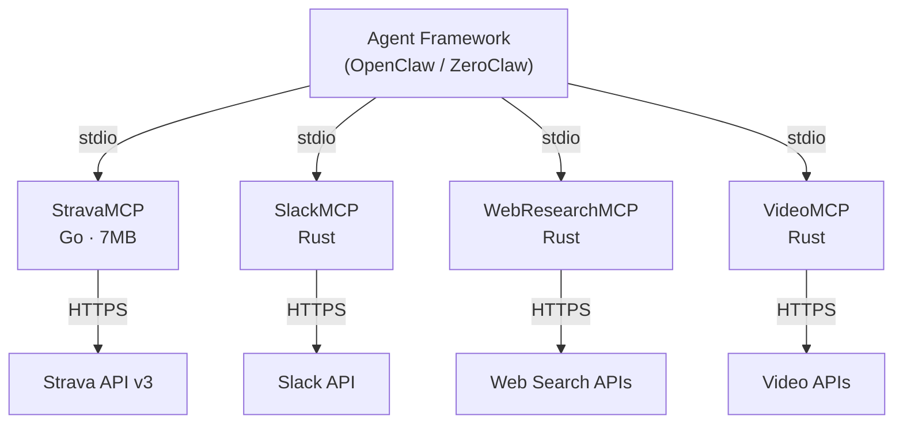

<objective>
Rewrite README.md to position StravaMCP as a production-grade MCP server for agent frameworks.

Purpose: README is the canonical source for all messaging. It must be updated first so docs site content (Plan 02) can mirror it accurately. This plan adds the "Why Go?" performance section, "Agent Framework Integration" ecosystem section, rewrites the hero tagline and feature bullets, and sweeps the entire file for tone (D-09).

Output: Updated README.md with production-grade positioning, performance comparison table, ecosystem Mermaid diagram, and agent framework JSON config snippet.
</objective>

<execution_context>
@$HOME/.claude/get-shit-done/workflows/execute-plan.md
@$HOME/.claude/get-shit-done/templates/summary.md
</execution_context>

<context>
@.planning/PROJECT.md
@.planning/ROADMAP.md
@.planning/STATE.md
@.planning/phases/05-openclaw-positioning-performance-messaging/05-CONTEXT.md
@.planning/phases/05-openclaw-positioning-performance-messaging/05-RESEARCH.md
@.planning/phases/05-openclaw-positioning-performance-messaging/05-UI-SPEC.md

<interfaces>
<!-- Current README.md structure (190 lines) that will be rewritten in-place -->
<!-- Executor MUST read full README.md before making changes -->

Current section order:
1. Badge row (lines 1-8)
2. # StravaMCP + hero tagline (lines 10-18)
3. ## How It Works - Mermaid graph LR (lines 20-27) -- DO NOT MODIFY
4. ## Features - 6 bullet list (lines 29-35)
5. ## Quick Start (lines 37-104) -- DO NOT MODIFY
6. <details> Tool Reference (lines 106-123) -- DO NOT MODIFY
7. <details> Architecture (lines 125-150) -- DO NOT MODIFY
8. ## Configuration (lines 152-167) -- DO NOT MODIFY
9. ## Development (lines 169-182) -- DO NOT MODIFY
10. ## License (lines 184-186) -- DO NOT MODIFY
11. ## Links (lines 188-192) -- DO NOT MODIFY
</interfaces>
</context>

<tasks>

<task type="auto">
  <name>Task 1: Rewrite README hero, features, and add Why Go? section</name>
  <files>README.md</files>
  <read_first>
    - README.md (current full content -- understand exact structure before editing)
    - .planning/phases/05-openclaw-positioning-performance-messaging/05-UI-SPEC.md (copywriting contract, performance table values, banned words)
    - .planning/phases/05-openclaw-positioning-performance-messaging/05-RESEARCH.md (verified performance numbers, reliability feature descriptions)
  </read_first>
  <action>
Modify README.md with the following changes. Preserve ALL existing sections from "## Quick Start" onward EXACTLY as they are (do not touch Quick Start, Tool Reference, Architecture, Configuration, Development, License, Links). Only modify the top portion and insert new sections.

**1. Badge row (keep all existing badges, no changes needed)**

**2. Hero tagline (D-09) -- replace lines 10-14:**

Replace the current `# StravaMCP` section with:

```
# StravaMCP

**A production-grade MCP server that gives agent frameworks full access to the Strava API -- single Go binary, zero infrastructure.**

StravaMCP is a [Model Context Protocol](https://modelcontextprotocol.io) server built in Go for the [OpenClaw/ZeroClaw](https://github.com/Stealinglight) agent framework ecosystem. It connects AI agents to the Strava API through a single static binary running on your machine. Communicates over stdio, works with any MCP-compatible client, handles OAuth authentication through an automatic browser flow, and stores tokens locally. No cloud services, no containers, no runtime dependencies -- just download and run.
```

**3. How It Works section -- DO NOT MODIFY the existing Mermaid graph LR block**

**4. Features section (D-09 reliability emphasis) -- replace the bullet list:**

```
## Features

- **Single binary, zero runtime dependencies** -- no Docker, no cloud, no database
- **11 MCP tools** covering activities, athlete stats, streams, clubs, and uploads
- **Automatic OAuth browser flow** -- one command to authenticate
- **Concurrent token refresh via singleflight** -- no thundering herd on expired tokens
- **Atomic write-then-rename token store** -- crash-safe credential persistence
- **Zero-CGO static binary** -- no C library dependencies, runs anywhere
- **Cross-platform** -- macOS (Intel + Apple Silicon) and Linux (amd64 + arm64)
```

**5. NEW: "## Why Go?" section (D-04, D-05, D-06) -- insert AFTER Features, BEFORE Quick Start:**

```
## Why Go?

StravaMCP is written in Go for the same reason the RustyClaw ecosystem exists: **performance and simplicity matter for tool servers that agents call hundreds of times per session.**

| | Go (StravaMCP) | Python | Node.js |
|---|---|---|---|
| **Startup time** | ~10ms | ~500ms | ~200ms |
| **Memory footprint** | ~8MB | ~30MB | ~40MB |
| **Binary size** | 7MB (single file) | ~50MB+ (runtime + deps) | ~60MB+ (runtime + node_modules) |
| **Dependencies** | 3 direct | Varies (pip) | Varies (npm) |
| **Runtime required** | None | Python interpreter | Node.js runtime |

*Estimates based on known Go/Python/Node.js runtime characteristics for comparable MCP servers. Not formal benchmarks.*
```

**6. NEW: "## Agent Framework Integration" section (D-01, D-02, D-03) -- insert AFTER Quick Start, BEFORE Tool Reference:**

```
## Agent Framework Integration

StravaMCP is part of the [OpenClaw/ZeroClaw](https://github.com/Stealinglight) agent framework ecosystem -- a collection of high-performance MCP servers that give AI agents access to external services via stdio transport.



To wire StravaMCP into an agent framework as a tool provider, add it to your MCP server configuration:

```json
{
  "mcpServers": {
    "strava": {
      "command": "strava-mcp",
      "env": {
        "STRAVA_CLIENT_ID": "your_client_id",
        "STRAVA_CLIENT_SECRET": "your_client_secret"
      }
    }
  }
}
```

The agent framework launches StravaMCP as a subprocess, communicates over stdio using the MCP protocol, and routes tool calls to Strava. No HTTP server, no port configuration -- stdio transport handles everything.
```

**7. Tone sweep (D-09):** After all section changes, verify the entire file. Remove any occurrence of "portfolio", "showcase", "demo", "toy", "experiment", "hobby", "personal", "side project". These words must not appear anywhere in the final README.md.

**Section order of final README.md:**
1. Badge row
2. `# StravaMCP` + updated hero tagline
3. Updated intro paragraph
4. `## How It Works` (existing, untouched)
5. `## Features` (updated bullets)
6. `## Why Go?` (NEW)
7. `## Quick Start` (existing, untouched)
8. `## Agent Framework Integration` (NEW)
9. `<details>` Tool Reference (existing, untouched)
10. `<details>` Architecture (existing, untouched)
11. `## Configuration` (existing, untouched)
12. `## Development` (existing, untouched)
13. `## License` (existing, untouched)
14. `## Links` (existing, untouched)
  </action>
  <verify>
    <automated>cd /Volumes/DataDeuce/Projects/StravaMCP && grep -c "## Why Go?" README.md && grep -c "## Agent Framework Integration" README.md && grep -c "production-grade" README.md && grep -c "graph TD" README.md | tail -1 && grep -ciE "portfolio|showcase|toy|experiment|hobby|side project" README.md | grep -q "^0$" && echo "TONE_CLEAN" || echo "TONE_DIRTY"</automated>
  </verify>
  <acceptance_criteria>
    - README.md contains exactly the string `## Why Go?` (one occurrence)
    - README.md contains exactly the string `## Agent Framework Integration` (one occurrence)
    - README.md contains `**A production-grade MCP server that gives agent frameworks full access to the Strava API`
    - README.md contains the performance table with `Go (StravaMCP)` column header
    - README.md contains `*Estimates based on known Go/Python/Node.js runtime characteristics` (D-06 disclaimer)
    - README.md contains `graph TD` in the new Agent Framework Integration section (ecosystem Mermaid diagram)
    - README.md still contains the original `graph LR` in How It Works (unchanged)
    - README.md still contains the original `graph TD` in Architecture details (unchanged)
    - README.md contains `"mcpServers"` JSON config snippet (D-03)
    - README.md contains `OpenClaw/ZeroClaw` (D-02 explainer)
    - README.md contains `singleflight` in Features section
    - README.md contains `Atomic write-then-rename` in Features section
    - README.md contains `Zero-CGO` in Features section
    - README.md contains zero occurrences of: portfolio, showcase, demo, toy, experiment, hobby, side project (case-insensitive grep returns 0)
    - `## Quick Start` section content is identical to before (unchanged)
    - `## Configuration` section content is identical to before (unchanged)
    - `go test ./...` still passes (no Go code accidentally modified)
  </acceptance_criteria>
  <done>README.md is fully updated with production-grade positioning: rewritten hero tagline, reliability-focused feature bullets, Why Go? performance comparison table with disclaimer, Agent Framework Integration section with ecosystem Mermaid diagram and JSON config snippet, and all banned words removed.</done>
</task>

</tasks>

<verification>
1. `grep -c "## Why Go?" README.md` returns 1
2. `grep -c "## Agent Framework Integration" README.md` returns 1
3. `grep -c "production-grade" README.md` returns at least 1
4. `grep -ciE "portfolio|showcase|demo|toy|experiment|hobby|personal project|side project" README.md` returns 0
5. `grep -c "graph LR" README.md` returns 1 (existing How It Works preserved)
6. `grep "graph TD" README.md | wc -l` returns 2 (existing Architecture + new Ecosystem)
7. `go test ./...` passes (no Go source accidentally modified)
</verification>

<success_criteria>
README.md positions StravaMCP as a production-grade MCP server for agent frameworks with:
- Updated hero tagline leading with "production-grade" and "agent frameworks" (D-09)
- Reliability-focused feature bullets: singleflight, atomic writes, zero-CGO (D-09)
- Why Go? comparison table with Go/Python/Node.js columns and disclaimer footnote (D-04, D-05, D-06)
- Agent Framework Integration section with Mermaid ecosystem diagram and JSON config (D-01, D-02, D-03)
- Zero banned words throughout (D-09 tone enforcement)
- All existing sections (Quick Start, Tool Reference, Architecture, Config, Dev, License, Links) unchanged
</success_criteria>

<output>
After completion, create `.planning/phases/05-openclaw-positioning-performance-messaging/05-01-SUMMARY.md`
</output>
