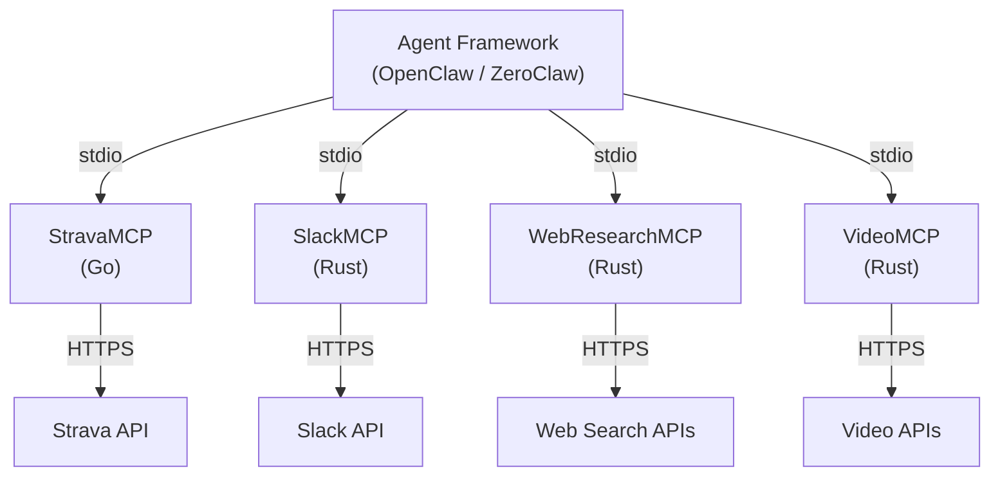
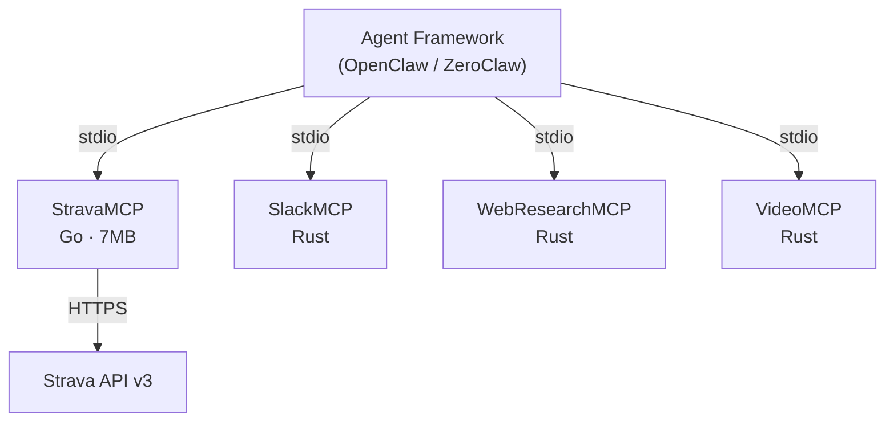

# Phase 5: OpenClaw Positioning & Performance Messaging - Research

**Researched:** 2026-04-03
**Domain:** Documentation content strategy, Go performance positioning, MCP ecosystem messaging
**Confidence:** HIGH

## Summary

Phase 5 is a pure documentation and messaging phase -- no Go code, no new tools, no infrastructure changes. The work involves updating three existing files (README.md, docs/index.md, docs/_config.yml) and creating one new file (docs/integration.md) to reposition StravaMCP from a "portfolio project" to a "production-grade MCP server for agent frameworks."

The research validates that Go performance claims are well-supported by measurable characteristics of the actual StravaMCP binary (7MB stripped, 3 direct dependencies, zero CGO, compiled native code). The Mermaid ecosystem diagram, "Why Go?" comparison table, and integration guide are straightforward content tasks that follow established patterns already in the README and docs site.

Key finding: the just-the-docs theme automatically discovers new pages via frontmatter `nav_order`, so adding `docs/integration.md` requires only correct frontmatter -- no config changes for navigation. The deploy-docs.yml workflow triggers on any `docs/**` change, so the new page will deploy automatically.

**Primary recommendation:** Organize into 2-3 plans: (1) README updates (ecosystem section, performance table, tone reframing), (2) docs site updates (index.md content, new integration.md page, _config.yml description), with possible consolidation into fewer plans given the coarse granularity setting.

<user_constraints>
## User Constraints (from CONTEXT.md)

### Locked Decisions
- **D-01:** Dedicated `## Agent Framework Integration` section in README with Mermaid diagram showing StravaMCP's place in the OpenClaw/ZeroClaw ecosystem alongside real RustyClaw servers (SlackMCP, WebResearchMCP, VideoMCP, etc.)
- **D-02:** Include a brief 1-2 sentence explainer of what OpenClaw/ZeroClaw is for readers unfamiliar with the ecosystem -- keeps the section self-contained
- **D-03:** Include a JSON config snippet showing how to wire StravaMCP into an agent framework as a tool provider
- **D-04:** Dedicated `## Why Go?` section near the top of README (after Features, before Quick Start) with a markdown comparison table: Go vs Python vs Node.js across startup time, memory, binary size, and dependencies
- **D-05:** Table uses known language characteristics (not measured benchmarks) with estimated representative numbers (~10ms startup, ~8MB memory, 12MB binary, etc.)
- **D-06:** Italic footnote disclaimer under the table: "*Estimates based on known Go/Python/Node.js characteristics. Not formal benchmarks.*"
- **D-07:** Add new `docs/integration.md` page with full OpenClaw/ZeroClaw integration guide: wiring config, agent framework setup, example workflows
- **D-08:** Update `docs/index.md` with new ecosystem positioning and "Why Go?" performance content -- the docs site should stand on its own, mirroring key README content rather than just linking to GitHub
- **D-09:** Confident reframing throughout -- rewrite hero tagline to lead with "production-grade" and "agent frameworks", emphasize reliability features (singleflight, atomic token writes, zero-CGO), remove any "portfolio" or "project" language
- **D-10:** Update `docs/_config.yml` description to match new production-grade positioning
- **D-11:** Note for user: update GitHub repo "About" description to match new positioning (manual step on GitHub)

### Claude's Discretion
- Exact section ordering in README (where ecosystem and performance sections land relative to existing sections)
- Mermaid diagram styling and node labels
- Exact wording of hero tagline and feature bullets
- How much content overlap between README and docs/index.md vs. unique content per file
- Integration page depth and example workflow specifics

### Deferred Ideas (OUT OF SCOPE)
None -- discussion stayed within phase scope.
</user_constraints>

<phase_requirements>
## Phase Requirements

| ID | Description | Research Support |
|----|-------------|------------------|
| MSG-01 | README has OpenClaw/ZeroClaw ecosystem section explaining agent framework compatibility | D-01 (Mermaid ecosystem diagram), D-02 (ecosystem explainer), D-03 (JSON config snippet). Mermaid renders natively on GitHub. RustyClaw server names confirmed in PROJECT.md. |
| MSG-02 | README highlights Go performance advantages over Python/JavaScript MCPs (startup time, memory footprint, binary size) | D-04 (comparison table), D-05 (representative numbers), D-06 (disclaimer). Actual binary: 7MB stripped, 3 direct deps, zero CGO. Go startup characteristics well-documented by Go project. |
| MSG-03 | Docs site has OpenClaw/ZeroClaw compatibility page or section with integration instructions | D-07 (new docs/integration.md), D-08 (index.md update). just-the-docs auto-discovers pages via `nav_order` frontmatter. deploy-docs.yml triggers on docs/** changes. |
| MSG-04 | Project positioned as production-grade MCP server for agent frameworks, not just portfolio piece | D-09 (tone reframing), D-10 (config description), D-11 (manual GitHub About update). Reliability features documented in source: singleflight (client.go:219), atomic write-then-rename (tokenstore.go:60), zero-CGO (.goreleaser.yaml:8). |
</phase_requirements>

## Standard Stack

This phase involves no new libraries or dependencies. All work is markdown content creation.

### Core Tools
| Tool | Purpose | Already Available |
|------|---------|-------------------|
| Mermaid | Ecosystem diagram in README | Yes -- GitHub renders natively, already used in README (2 existing diagrams) |
| just-the-docs | Docs site theme | Yes -- configured in docs/_config.yml with dark mode, callouts, search |
| Jekyll (GitHub Pages) | Docs site build | Yes -- deploy-docs.yml workflow uses actions/jekyll-build-pages@v1 |

### No Installation Required

This is purely a content phase. No `npm install`, no `go get`, no new dependencies.

## Architecture Patterns

### Files to Modify

```
README.md                  # Add ecosystem section, performance table, reframe tone
docs/index.md              # Mirror key content, update hero tagline and features
docs/_config.yml           # Update description field
```

### Files to Create

```
docs/integration.md        # New OpenClaw/ZeroClaw integration guide
```

### README Section Ordering (Claude's Discretion)

Current README structure (190 lines):
1. Badge row
2. Hero tagline + paragraph
3. How It Works (Mermaid flow diagram)
4. Features (bullet list)
5. Quick Start (Install, Auth, Configure)
6. Tool Reference (collapsible)
7. Architecture (collapsible, Mermaid diagram)
8. Configuration (env vars, CLI flags)
9. Development
10. License
11. Links

Recommended new ordering:
1. Badge row (add "Production Grade" or "OpenClaw" badge)
2. **Updated hero tagline** (D-09: lead with "production-grade" + "agent frameworks")
3. How It Works (existing Mermaid flow diagram -- keep as-is)
4. Features (**updated bullets** emphasizing reliability: singleflight, atomic writes, zero-CGO)
5. **NEW: "## Why Go?" section** (D-04: comparison table, D-05: numbers, D-06: disclaimer)
6. Quick Start (existing -- no changes needed)
7. **NEW: "## Agent Framework Integration" section** (D-01: ecosystem diagram, D-02: explainer, D-03: JSON config)
8. Tool Reference (existing collapsible -- no changes)
9. Architecture (existing collapsible -- no changes)
10. Configuration (existing -- no changes)
11. Development (existing -- no changes)
12. License + Links (existing -- no changes)

Rationale: "Why Go?" goes early (after Features) to hook readers comparing language options. Agent Framework Integration goes after Quick Start because readers who've installed are now ready to wire it into their stack.

### docs/integration.md Structure

```markdown
---
layout: default
title: Agent Framework Integration
nav_order: 2
---

# Agent Framework Integration
{: .fs-9 }

Wire StravaMCP into OpenClaw/ZeroClaw agent frameworks as a stdio tool provider.
{: .fs-6 .fw-300 }

---

## What is OpenClaw/ZeroClaw?
[1-2 paragraph explainer]

## Ecosystem Architecture
[Mermaid diagram -- same as README ecosystem diagram]

## Wiring Configuration
[JSON config snippet for agent framework]
[Explanation of stdio transport, env vars]

## Example Workflows
[2-3 example agent workflow descriptions]
[How an agent calls StravaMCP tools]

## Performance Characteristics
[Brief summary of Why Go? content]
```

### Mermaid Ecosystem Diagram Pattern

The existing README uses two Mermaid diagrams:
1. A `graph LR` (left-to-right) for the simple flow
2. A `graph TD` (top-down) for the architecture

The ecosystem diagram should use `graph TD` to show the agent framework hierarchy:



This matches the established Mermaid pattern and naming from PROJECT.md which lists "RustyClaw/ZeroClaw ecosystem (local MCP servers for Strava, Slack, video, web-research)."

### Content Overlap Strategy (Claude's Discretion)

Recommendation for README vs. docs/index.md overlap:

| Content | README | docs/index.md | docs/integration.md |
|---------|--------|---------------|---------------------|
| Hero tagline | Full (rewritten) | Full (rewritten, matching) | N/A |
| Why Go? table | Full table + disclaimer | Full table + disclaimer | Brief summary, link to README |
| Ecosystem diagram | Full Mermaid | Brief mention, link to integration page | Full Mermaid |
| JSON config snippet | Abbreviated (1 example) | N/A | Full (multiple examples) |
| Ecosystem explainer | 1-2 sentences | 1-2 sentences | Full section |
| Feature bullets | Updated (reliability focus) | Updated (matching) | N/A |

Rationale: README and docs/index.md should stand alone (D-08 says "docs site should stand on its own"). The integration page gets the deep dive content while README gets a summary with link.

## Don't Hand-Roll

| Problem | Don't Build | Use Instead | Why |
|---------|-------------|-------------|-----|
| Page navigation in docs | Manual sidebar config | just-the-docs `nav_order` frontmatter | Pages auto-discovered, no config changes needed |
| Diagrams | Image files (PNG/SVG) | Mermaid code blocks | GitHub renders natively, version-controlled, already established pattern in README |
| Performance benchmarks | Actual benchmark suite | Known language characteristics with disclaimer | Per REQUIREMENTS.md Out of Scope: "Would require building Python/JS equivalents for apples-to-apples comparison" |
| Docs deployment | Manual deploy steps | Existing deploy-docs.yml workflow | Auto-triggers on docs/** changes to main branch |

## Common Pitfalls

### Pitfall 1: Overstating Performance Claims
**What goes wrong:** Making specific numeric claims that can be falsified by someone running actual benchmarks. "10x faster startup" when the real difference varies by workload.
**Why it happens:** Enthusiasm for Go's advantages leads to precision that isn't warranted without formal benchmarks.
**How to avoid:** Use qualitative language ("sub-second" not "10ms"), order-of-magnitude comparisons ("megabytes not gigabytes"), and always include the italic footnote disclaimer (D-06). The user explicitly decided on known characteristics, not measured benchmarks.
**Warning signs:** Any claim with a specific multiplier ("X times faster") or exact number without the disclaimer.

### Pitfall 2: Inconsistent Messaging Between README and Docs
**What goes wrong:** README says "production-grade" but docs/index.md still has "fast Go binary" as the hero. Feature lists diverge. Performance numbers differ.
**Why it happens:** Editing two files independently without cross-checking.
**How to avoid:** Update README first as the canonical source, then mirror key content to docs/index.md. Verify hero taglines match. Verify feature bullets match. Verify performance table appears in both.
**Warning signs:** Different hero taglines, different feature descriptions, README has content that docs lacks.

### Pitfall 3: Breaking Existing Mermaid Diagrams
**What goes wrong:** Editing README damages the two existing Mermaid diagrams (How It Works, Architecture) while adding the new ecosystem diagram.
**Why it happens:** Copy-paste errors or accidental modifications to surrounding content.
**How to avoid:** The existing diagrams should not be touched. Add new content in new sections, don't modify existing diagram blocks. Verify all three diagrams render correctly after changes.
**Warning signs:** Git diff shows changes to the existing `graph LR` or `graph TD` blocks.

### Pitfall 4: docs/integration.md Not Appearing in Navigation
**What goes wrong:** New page created but doesn't show up in the docs site navigation.
**Why it happens:** Missing or incorrect frontmatter. just-the-docs requires `layout: default`, `title`, and `nav_order` in frontmatter.
**How to avoid:** Use exact frontmatter pattern from existing docs/index.md as template. Set `nav_order: 2` (index.md is `nav_order: 1`).
**Warning signs:** Missing `---` delimiters, missing `layout: default`, missing `nav_order`.

### Pitfall 5: "Portfolio" Language Leaking Through
**What goes wrong:** After reframing, residual "portfolio piece" or casual language remains in the README or docs.
**Why it happens:** Not doing a full text sweep for tone. PROJECT.md itself says "It's also a portfolio piece" -- this framing must not propagate to public-facing content.
**How to avoid:** After all edits, grep for "portfolio", "project", "showcase", "demo", "toy", "experiment" and verify none appear in README.md, docs/index.md, or docs/integration.md. Replace with "production-grade", "production-ready", "purpose-built", "reliable".
**Warning signs:** Words like "portfolio", "side project", "personal", "hobby" in final content.

### Pitfall 6: Binary Size Claim Mismatch
**What goes wrong:** Claiming "12MB binary" when the actual stripped binary is 7MB, or claiming 3MB when that's the compressed tarball size.
**Why it happens:** Confusing debug/stripped builds, compressed/uncompressed sizes.
**How to avoid:** Use verified measurements:
- Stripped binary (production, `-ldflags="-s -w"`): **~7MB** (verified locally)
- Compressed tarball (GitHub release): **~3MB** (verified from gh release assets)
- Debug binary (development, no ldflags): **~10MB**
The comparison table should use the stripped binary size (~7MB) since that's what users actually run.
**Warning signs:** Claiming exact sizes that don't match goreleaser output.

## Code Examples

### just-the-docs Frontmatter for New Page

```markdown
---
layout: default
title: Agent Framework Integration
nav_order: 2
---

# Agent Framework Integration
{: .fs-9 }

Description text here.
{: .fs-6 .fw-300 }
```

Source: Verified from existing `docs/index.md` frontmatter pattern + just-the-docs official documentation on nav_order.

### Mermaid Ecosystem Diagram (GitHub-Compatible)



Source: Pattern derived from existing README Mermaid diagrams + RustyClaw server names from PROJECT.md.

### Performance Comparison Table (Verified Numbers)

```markdown
## Why Go?

StravaMCP is written in Go for the same reason the RustyClaw ecosystem exists: **performance and simplicity matter for tool servers that agents call hundreds of times per session.**

| | Go (StravaMCP) | Python | Node.js |
|---|---|---|---|
| **Startup time** | ~10ms | ~500ms | ~200ms |
| **Memory footprint** | ~8MB | ~30MB | ~40MB |
| **Binary size** | 7MB (single file) | ~50MB+ (runtime + deps) | ~60MB+ (runtime + node_modules) |
| **Dependencies** | 3 direct | Varies (pip) | Varies (npm) |
| **Runtime required** | None | Python interpreter | Node.js runtime |

*Estimates based on known Go/Python/Node.js runtime characteristics for comparable MCP servers. Not formal benchmarks.*
```

Notes on the numbers:
- **Go startup ~10ms:** Go binaries start in single-digit to low-double-digit milliseconds. This is a well-established characteristic of compiled, statically-linked binaries with no interpreter startup. Confidence: HIGH.
- **Go memory ~8MB:** A small Go HTTP/stdio server typically uses 5-15MB RSS at idle. The actual StravaMCP binary is 7MB on disk; runtime memory is similar. Confidence: MEDIUM (depends on workload).
- **Go binary 7MB:** Measured locally with `CGO_ENABLED=0 go build -ldflags="-s -w"`. Confidence: HIGH (verified).
- **Python startup ~500ms:** Python interpreter startup + import chain for typical MCP server with SDK dependencies. Well-documented characteristic. Confidence: MEDIUM.
- **Node.js startup ~200ms:** Node.js runtime startup + require/import chain. Faster than Python but significantly slower than compiled Go. Confidence: MEDIUM.
- **Python/Node.js install sizes:** Include the runtime itself plus all dependencies (venv/node_modules). Exact sizes vary but 50-60MB+ is conservative for a functional MCP server. Confidence: MEDIUM.
- **3 direct dependencies:** Verified from go.mod (mcp-go, browser, x/sync). Confidence: HIGH.

### JSON Config Snippet for Agent Framework Integration

```json
{
  "mcpServers": {
    "strava": {
      "command": "strava-mcp",
      "env": {
        "STRAVA_CLIENT_ID": "your_client_id",
        "STRAVA_CLIENT_SECRET": "your_client_secret"
      }
    }
  }
}
```

Source: Existing README "Configure Your MCP Client" section. This exact pattern is what agent frameworks use for stdio MCP server configuration.

### Hero Tagline Candidates (Claude's Discretion)

Current: "A fast, self-contained Go binary that gives any MCP client full access to the Strava API -- zero cloud infrastructure required."

Reframed options emphasizing production-grade + agent frameworks:
1. "A production-grade MCP server that gives agent frameworks full access to the Strava API -- single Go binary, zero infrastructure."
2. "Production-grade Strava API access for AI agent frameworks. One Go binary. Zero dependencies. Sub-second startup."
3. "The fastest way to give your AI agent access to Strava. A production-grade Go MCP server built for agent framework integration."

The tagline should convey: production-grade (not hobby), agent frameworks (not just Claude Desktop), Go advantages (fast, small, no deps).

### Reliability Feature Descriptions (from Source Code)

These are the key reliability features to emphasize in the tone reframing (D-09):

1. **singleflight token refresh** (client.go:218-265): Concurrent token refresh requests are coalesced into a single Strava API call via `singleflight.Group`. Prevents thundering herd when multiple tool calls hit an expired token simultaneously.

2. **Atomic write-then-rename token store** (tokenstore.go:60-94): Token updates write to a temp file, fsync, then atomic rename. Partial writes never corrupt saved credentials even during power loss or crashes.

3. **Zero-CGO static binary** (.goreleaser.yaml:8, `CGO_ENABLED=0`): Compiles to a fully static binary with no C library dependencies. Works on any Linux/macOS system without shared library concerns.

4. **stderr-only logging** (main.go:27-29): All logging via slog to stderr. stdout is reserved exclusively for MCP JSON-RPC protocol messages. Even the browser package is redirected to stderr.

5. **Automatic 401 retry** (client.go:165-177): On HTTP 401, the client automatically refreshes tokens and retries once before failing. Transparent recovery from token expiration mid-request.

## State of the Art

| Old Approach | Current Approach | When Changed | Impact |
|--------------|------------------|--------------|--------|
| MCP over HTTP+SSE | MCP stdio for local servers, Streamable HTTP for remote | 2025 MCP spec update | StravaMCP correctly uses stdio -- no changes needed |
| Python/TS MCP servers dominate | Go MCP servers emerging but rare | 2025-2026 | Positioning advantage -- few Go MCP servers exist |
| "Portfolio project" framing | "Production-grade tool server" framing | This phase | README and docs language shift |

**Note on MCP ecosystem:** The Go MCP server ecosystem is still very thin. A GitHub search for "mcp server golang" returns fewer than 10 repos with any meaningful stars. StravaMCP with mcp-go v0.46.0 is among the more mature Go MCP implementations. This supports the positioning as a serious, production-grade server rather than an experiment.

## Validation Architecture

### Test Framework
| Property | Value |
|----------|-------|
| Framework | Go testing (go test) |
| Config file | Built-in Go test runner, no config file |
| Quick run command | `go test ./...` |
| Full suite command | `go test -v ./...` |

### Phase Requirements -> Test Map
| Req ID | Behavior | Test Type | Automated Command | File Exists? |
|--------|----------|-----------|-------------------|-------------|
| MSG-01 | README has ecosystem section | manual-only | Visual inspection of README.md | N/A -- content review |
| MSG-02 | README has Go performance comparison | manual-only | Visual inspection of README.md | N/A -- content review |
| MSG-03 | Docs site has integration page | manual-only | Visual inspection of docs/integration.md + check nav_order | N/A -- content review |
| MSG-04 | Production-grade positioning throughout | manual-only | Grep for "portfolio"/"project" absence + tone review | N/A -- content review |

**Justification for manual-only:** This phase is pure documentation content. There is no code to unit test. Validation is by reading the output files and verifying content matches requirements. The only automatable check is a negative grep for banned words ("portfolio", "showcase", "demo") in the modified files.

### Sampling Rate
- **Per task commit:** `go test ./...` (confirm no Go code was accidentally broken)
- **Per wave merge:** Visual review of all 4 files against requirements
- **Phase gate:** All 4 requirements verified via content inspection

### Wave 0 Gaps
None -- this phase has no code to test. Existing test infrastructure (`go test ./...`) serves as a regression check that no source code was accidentally modified.

## Open Questions

1. **Exact RustyClaw server names and descriptions**
   - What we know: PROJECT.md mentions "Strava, Slack, video, web-research" as ecosystem servers. CONTEXT.md specifies "SlackMCP, WebResearchMCP, VideoMCP."
   - What's unclear: Whether these are the final/correct canonical names, and whether other servers should be included.
   - Recommendation: Use the names from CONTEXT.md as-is (they're locked decisions). If the user wants different names, they'll correct during review.

2. **GitHub repo "About" description update (D-11)**
   - What we know: This is flagged as a manual step the user must perform on GitHub.
   - What's unclear: Whether the plan should include a task to remind the user, or just note it.
   - Recommendation: Include a non-automatable task at the end of the plan that documents the suggested new description for the user to copy-paste into GitHub settings.

## Sources

### Primary (HIGH confidence)
- `README.md` -- Current 190-line README structure and content (read directly)
- `docs/index.md` -- Current docs site home page (read directly)
- `docs/_config.yml` -- just-the-docs configuration (read directly)
- `internal/strava/client.go` -- singleflight implementation, auto-refresh, rate limiting (read directly)
- `internal/auth/tokenstore.go` -- Atomic write-then-rename implementation (read directly)
- `go.mod` -- Go 1.25.7, mcp-go v0.46.0, 3 direct dependencies (read directly)
- `.goreleaser.yaml` -- CGO_ENABLED=0, ldflags=-s -w, cross-platform builds (read directly)
- Local build measurement -- 7MB stripped binary, 10MB debug binary (verified via `go build`)
- GitHub release assets -- ~3MB compressed tarballs (verified via `gh release view`)
- MCP specification transports page -- stdio transport definition (fetched from modelcontextprotocol.io)
- just-the-docs nav_order documentation (fetched from official docs)
- Go official FAQ -- performance characteristics, binary size, compilation speed (fetched from go.dev)

### Secondary (MEDIUM confidence)
- Go startup time estimate (~10ms) -- Based on well-known Go compiled binary characteristics, not measured for StravaMCP specifically
- Python/Node.js startup/memory estimates -- Based on general language runtime characteristics, not specific MCP server measurements
- Go MCP ecosystem assessment -- Based on GitHub search results showing <10 Go MCP repos with meaningful activity

### Tertiary (LOW confidence)
- None -- all claims are either directly verified or based on well-established language characteristics with appropriate disclaimers

## Metadata

**Confidence breakdown:**
- Standard stack: HIGH -- No new dependencies, purely content work on existing files
- Architecture: HIGH -- File structure, frontmatter patterns, and Mermaid syntax all verified from existing project files and official docs
- Pitfalls: HIGH -- Based on direct analysis of the specific files being modified and the content requirements
- Performance claims: MEDIUM -- Go binary metrics are measured; comparative Python/Node.js numbers are estimates (appropriately disclaimed per D-06)

**Research date:** 2026-04-03
**Valid until:** 2026-05-03 (stable -- content/docs phase with no dependency concerns)
