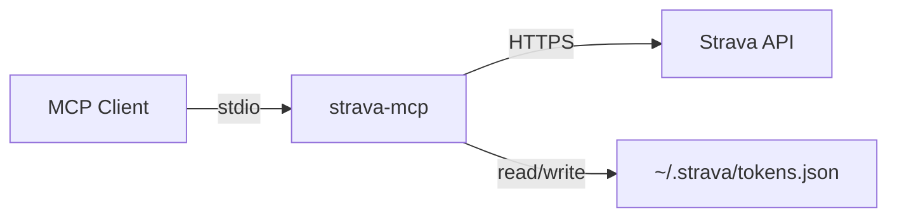
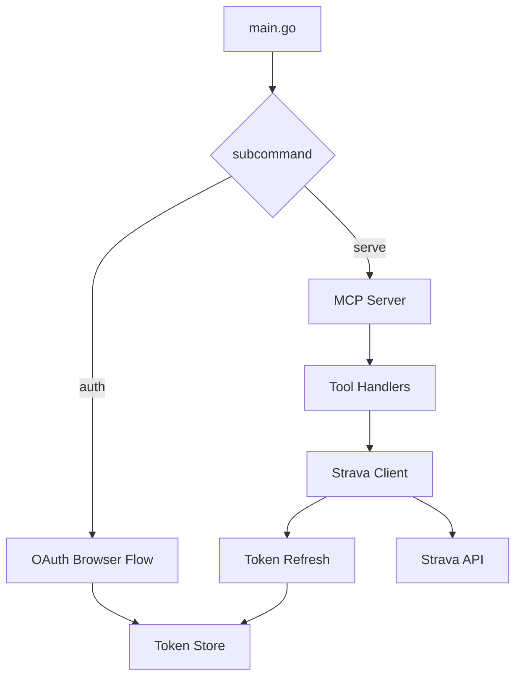

# Phase 3: Polish and Distribution - Research

**Researched:** 2026-03-27
**Domain:** README rewrite, goreleaser cross-compilation, Homebrew distribution, legacy cleanup, GitHub Actions
**Confidence:** HIGH

## Summary

Phase 3 transforms the StravaMCP project from a working Go binary with stale TypeScript-era documentation into a portfolio-ready open-source project with polished README, automated cross-platform binary releases, and clean repository structure. The core work is: (1) complete README rewrite for the Go binary, (2) goreleaser configuration for cross-platform builds with Homebrew cask distribution, (3) GitHub Actions release workflow on version tags, (4) removal of all TypeScript/Lambda legacy artifacts, (5) CONTRIBUTING.md rewrite for Go, and (6) GitHub repo metadata updates.

The existing codebase has a fully working Go binary (`strava-mcp`) with 11 MCP tools, 80+ passing tests, and ldflags-ready version variables already defined in `main.go`. The README, CONTRIBUTING.md, docs site, and GitHub workflows all describe the old TypeScript/Lambda version and must be completely rewritten or removed.

**Primary recommendation:** Use goreleaser v2 with `homebrew_casks` (NOT deprecated `brews`) for release automation, triggered by a GitHub Actions workflow on version tags. Write the README from scratch -- the old one shares zero content with the Go project.

<user_constraints>

## User Constraints (from CONTEXT.md)

### Locked Decisions
- **D-01:** Complete rewrite of README.md -- the existing README describes the old TypeScript/Lambda version and shares nothing with the Go binary project. Start fresh.
- **D-02:** Premium visual polish -- badges row, custom hero section, feature highlights with icons/emoji, collapsible sections, tool reference table, architecture diagrams, terminal recording.
- **D-03:** Include terminal recording (asciinema or SVG) showing the auth flow and a tool call in action. High portfolio impact.
- **D-04:** All three badge categories: standard Go badges (Go version, Go Report Card, GoDoc, License), CI/release badges (build status, latest release, downloads), project badges (MCP version, tool count, coverage).
- **D-05:** Tool reference as grouped table with descriptions -- categories: Activities (5), Athlete (2), Streams (1), Clubs (1), Uploads (2). One-line description per tool.
- **D-06:** Mermaid format -- GitHub renders natively, version-controlled, easy to maintain.
- **D-07:** Two diagrams: high-level flow at top of README (MCP Client -> stdio -> Go Binary -> Strava API), detailed internal structure in Architecture section (config -> auth/token store -> Strava client -> tool handlers -> MCP server).
- **D-08:** Two equal installation paths in Quick Start: `go install` for Go developers, binary download from GitHub Releases for everyone else.
- **D-09:** goreleaser targets macOS + Linux: darwin/amd64, darwin/arm64, linux/amd64, linux/arm64.
- **D-10:** Set up Homebrew tap via goreleaser auto-generation. `brew install Stealinglight/tap/strava-mcp`.
- **D-11:** GitHub Actions release workflow triggered on version tags. Replaces all old Lambda/docs workflows.
- **D-12:** Remove ALL TypeScript/Lambda artifacts: src/, docs/, template.yaml, package.json, bun.lockb, tsconfig.json, samconfig.toml, get-token.js, node_modules references, and any other non-Go files from the old project.
- **D-13:** Replace GitHub Pages docs site with simple Go-focused pages. Strip Lambda content, add basic documentation for the Go binary. Keep the GitHub Pages URL alive.
- **D-14:** Remove all old GitHub Actions workflows: deploy-lambda.yml, deploy-docs.yml, release-openclaw-plugin.yml. Keep claude.yml and claude-code-review.yml. Add new goreleaser release workflow.
- **D-15:** Create/update CONTRIBUTING.md for the Go project -- build instructions, test commands, PR guidelines.
- **D-16:** Update GitHub repo description, topics, and homepage URL to reflect the Go rewrite.

### Claude's Discretion
- README section ordering and exact heading hierarchy
- Mermaid diagram styling and color scheme
- goreleaser configuration details (archive format, changelog generation, etc.)
- Exact badge service URLs and shield.io parameters
- Terminal recording tool choice (asciinema vs svg-term vs vhs)
- docs/ page structure and content depth

### Deferred Ideas (OUT OF SCOPE)
None -- discussion stayed within phase scope.

</user_constraints>

<phase_requirements>

## Phase Requirements

| ID | Description | Research Support |
|----|-------------|------------------|
| DOCS-01 | Portfolio-quality README with badges, architecture diagram, feature list, quick start, visual polish | Badges URL patterns (shields.io, goreportcard), Mermaid diagram syntax for GitHub, README structure patterns from top Go projects, collapsible HTML sections |
| DOCS-02 | Single-binary distribution via go install and goreleaser (multi-platform builds) | goreleaser v2 configuration (builds, archives, homebrew_casks, changelog), GitHub Actions workflow, ldflags version injection, Homebrew tap setup |

</phase_requirements>

## Standard Stack

### Core
| Tool | Version | Purpose | Why Standard |
|------|---------|---------|--------------|
| goreleaser | v2 (latest) | Cross-platform Go binary builds, release automation | De facto standard for Go project releases; used by Hugo, Kubernetes tools, Charm projects |
| goreleaser-action | v7 | GitHub Actions integration for goreleaser | Official action, handles setup + execution |
| shields.io | N/A (service) | Badge generation for README | Universal standard for open-source project badges |
| Mermaid | N/A (GitHub-native) | Architecture diagrams in markdown | GitHub renders natively, no external service needed |

### Supporting
| Tool | Version | Purpose | When to Use |
|------|---------|---------|-------------|
| VHS (charmbracelet/vhs) | latest | Terminal recording as GIF | For D-03 terminal recording; not installed locally but can be installed via brew |
| Go Report Card | N/A (service) | Code quality badge | Badge URL: `https://goreportcard.com/badge/github.com/Stealinglight/StravaMCP` |
| pkg.go.dev | N/A (service) | GoDoc badge and documentation | Auto-generated from public Go module |

### Alternatives Considered
| Instead of | Could Use | Tradeoff |
|------------|-----------|----------|
| VHS | asciinema + svg-term | VHS is declarative (tape files), better for reproducibility; asciinema requires interactive recording |
| goreleaser | Manual `go build` + GitHub CLI releases | goreleaser handles cross-compilation, checksums, changelogs, Homebrew tap in one config |
| Mermaid | Draw.io / Excalidraw images | Mermaid is version-controlled text, GitHub renders it natively; images require separate files |

## Architecture Patterns

### Recommended Project Structure (After Cleanup)
```
/StravaMCP
├── .github/
│   └── workflows/
│       ├── claude.yml              # Keep (Claude AI integration)
│       ├── claude-code-review.yml  # Keep (code review)
│       ├── release.yml             # NEW: goreleaser on version tags
│       └── ci.yml                  # NEW: go test on PRs/pushes (optional)
├── docs/                           # Rewritten for Go binary
│   ├── _config.yml                 # Updated Jekyll config
│   └── index.md                    # Simplified Go-focused landing page
├── internal/                       # Go source (untouched)
│   ├── auth/
│   ├── config/
│   ├── server/
│   ├── strava/
│   └── tools/
├── .goreleaser.yaml                # NEW: release configuration
├── CONTRIBUTING.md                 # Rewritten for Go
├── LICENSE                         # NEW: ISC license file (missing!)
├── README.md                       # Complete rewrite
├── go.mod
├── go.sum
└── main.go
```

### Files to DELETE (D-12, D-14)
```
# TypeScript/Lambda artifacts
src/                    # Entire TypeScript source tree
dist/                   # Build output
node_modules/           # npm dependencies (if present)
package.json            # npm package config
bun.lock                # Bun lockfile
tsconfig.json           # TypeScript config
template.yaml           # AWS SAM template
samconfig.toml          # SAM deployment config
get-token.js            # Old OAuth token helper
run.sh                  # Old run script
scripts/                # TypeScript deploy scripts
.aws-sam/               # SAM build artifacts
.env                    # Local env file (should not be in repo)
.env.example            # Lambda-era env template
AGENTS.md               # Old agents documentation
openclaw-plugin/        # OpenClaw plugin (separate project)

# Old GitHub Actions workflows
.github/workflows/deploy-lambda.yml
.github/workflows/deploy-docs.yml
.github/workflows/release-openclaw-plugin.yml
.github/workflows/README.md
```

### Pattern: goreleaser Configuration
**What:** Single `.goreleaser.yaml` that defines builds, archives, changelog, and Homebrew distribution.
**When to use:** Every Go project that distributes binaries.

```yaml
# .goreleaser.yaml
version: 2

builds:
  - id: strava-mcp
    main: .
    binary: strava-mcp
    env:
      - CGO_ENABLED=0
    goos:
      - darwin
      - linux
    goarch:
      - amd64
      - arm64
    ldflags:
      - -s -w
      - -X main.Version={{.Version}}
      - -X main.Commit={{.ShortCommit}}
      - -X main.Date={{.Date}}

archives:
  - id: default
    format: tar.gz
    name_template: "{{ .ProjectName }}_{{ .Version }}_{{ .Os }}_{{ .Arch }}"
    files:
      - README.md
      - LICENSE

changelog:
  use: github
  sort: asc
  groups:
    - title: Features
      regexp: '^.*?feat(\([[:word:]]+\))??!?:.+$'
      order: 0
    - title: Bug Fixes
      regexp: '^.*?(fix|bug)(\([[:word:]]+\))??!?:.+$'
      order: 1
    - title: Others
      order: 999
  filters:
    exclude:
      - "^docs:"
      - "^chore:"
      - "^ci:"

homebrew_casks:
  - name: strava-mcp
    repository:
      owner: Stealinglight
      name: homebrew-tap
      branch: main
    binaries:
      - strava-mcp
    description: "MCP server for Strava API - local Go binary with zero cloud infrastructure"
    homepage: "https://github.com/Stealinglight/StravaMCP"
    commit_msg_template: "Cask update for {{ .ProjectName }} {{ .Tag }}"
    directory: Casks
```

### Pattern: GitHub Actions Release Workflow
**What:** Workflow triggered on version tags that runs goreleaser.
**When to use:** On push of `v*` tags.

```yaml
# .github/workflows/release.yml
name: Release

on:
  push:
    tags:
      - "v*"

permissions:
  contents: write

jobs:
  release:
    runs-on: ubuntu-latest
    steps:
      - name: Checkout
        uses: actions/checkout@v4
        with:
          fetch-depth: 0

      - name: Set up Go
        uses: actions/setup-go@v5
        with:
          go-version: stable

      - name: Run GoReleaser
        uses: goreleaser/goreleaser-action@v7
        with:
          distribution: goreleaser
          version: "~> v2"
          args: release --clean
        env:
          GITHUB_TOKEN: ${{ secrets.GITHUB_TOKEN }}
```

### Pattern: README Badge Row
**What:** Horizontal row of shields.io badges at the top of README.
**Example:**

```markdown
[](https://go.dev/)
[](https://goreportcard.com/report/github.com/Stealinglight/StravaMCP)
[](https://github.com/Stealinglight/StravaMCP/releases/latest)
[](LICENSE)
[](https://github.com/Stealinglight/StravaMCP/actions)
```

### Pattern: Mermaid Architecture Diagrams
**What:** GitHub-rendered diagrams embedded in markdown.
**High-level flow example:**

````markdown

````

**Internal architecture example:**

````markdown

````

### Anti-Patterns to Avoid
- **Stale badge URLs:** Do not hardcode version numbers in badge URLs. Use dynamic shields.io endpoints that pull from GitHub/Go modules.
- **Non-reproducible terminal recordings:** Use VHS tape files (committed to repo) rather than manual screen recordings.
- **Incomplete cleanup:** Missing a single TypeScript artifact (like `tsconfig.json`) undermines the "Go rewrite" narrative. Audit exhaustively.
- **Homebrew formula instead of cask:** goreleaser v2 removed `brews` support entirely. Must use `homebrew_casks`.

## Don't Hand-Roll

| Problem | Don't Build | Use Instead | Why |
|---------|-------------|-------------|-----|
| Cross-platform binary builds | Manual `GOOS=X GOARCH=Y go build` scripts | goreleaser | Handles checksums, archives, changelogs, Homebrew, GitHub Release in one tool |
| Release changelog | Manual CHANGELOG.md | goreleaser changelog from git commits | Auto-generated, grouped by conventional commit type |
| Badge images | Custom SVG files | shields.io dynamic badges | Auto-updates on new releases, no maintenance |
| Architecture diagrams | PNG/SVG image files | Mermaid in markdown | Version-controlled, GitHub renders natively, easy to update |
| Homebrew tap formula | Manual Ruby formula | goreleaser `homebrew_casks` | Auto-generated on each release, no manual tap repo maintenance |

**Key insight:** Every piece of release infrastructure should be generated from configuration, not maintained manually. The goreleaser + GitHub Actions combo handles 90% of the distribution work.

## Common Pitfalls

### Pitfall 1: goreleaser v2 uses homebrew_casks, not brews
**What goes wrong:** Using the `brews` configuration key which was removed in goreleaser v2 (May 2024).
**Why it happens:** Most online tutorials and examples reference the old `brews` syntax.
**How to avoid:** Use `homebrew_casks` section. The configuration is similar but uses `binaries` array instead of `install` block.
**Warning signs:** goreleaser errors about unknown configuration keys.

### Pitfall 2: Missing fetch-depth: 0 in GitHub Actions checkout
**What goes wrong:** goreleaser cannot determine version from git tags, produces `v0.0.0` or fails.
**Why it happens:** Default `actions/checkout` depth is 1 (only latest commit).
**How to avoid:** Always set `fetch-depth: 0` in the checkout step.
**Warning signs:** Release version is wrong or goreleaser complains about git history.

### Pitfall 3: Homebrew tap requires a separate repository
**What goes wrong:** goreleaser fails to push the Homebrew cask formula.
**Why it happens:** The tap must be a separate GitHub repository named `homebrew-tap` under the same owner.
**How to avoid:** Create `Stealinglight/homebrew-tap` repository on GitHub before the first release. goreleaser needs a `GITHUB_TOKEN` with write access to push the cask formula there.
**Warning signs:** Permission denied errors during goreleaser Homebrew step.

### Pitfall 4: go install path needs module path, not GitHub URL
**What goes wrong:** `go install` fails because the module path in go.mod is `strava-mcp` (local), not a full GitHub path.
**Why it happens:** The go.mod module path was set to `strava-mcp` during Phase 1 for simplicity.
**How to avoid:** The module path in `go.mod` must be `github.com/Stealinglight/StravaMCP` for `go install` to work. This requires updating `go.mod` and all internal import paths. This is a prerequisite for D-08.
**Warning signs:** `go install strava-mcp@latest` fails with "unrecognized import path."

### Pitfall 5: macOS Gatekeeper blocks unsigned binaries
**What goes wrong:** Users download the binary from GitHub Releases but macOS prevents execution.
**Why it happens:** goreleaser-built binaries are not code-signed or notarized.
**How to avoid:** The Homebrew cask includes a post-install hook to strip quarantine attributes (`xattr -dr com.apple.quarantine`). Document the manual `xattr` command in README for direct download users.
**Warning signs:** "strava-mcp cannot be opened because the developer cannot be verified" error on macOS.

### Pitfall 6: No LICENSE file exists
**What goes wrong:** The license badge shows "unknown" and goreleaser cannot include LICENSE in archives.
**Why it happens:** The old project had ISC license declared in package.json but never created a standalone LICENSE file.
**How to avoid:** Create a LICENSE file with ISC license text before the first release.
**Warning signs:** shields.io license badge shows "not found."

### Pitfall 7: .gitignore blocks Go binary but also blocks goreleaser snapshot testing
**What goes wrong:** Local `goreleaser release --snapshot` outputs are ignored by git, which is correct. But the `.gitignore` entry `*.js` also ignores legitimate files if any JS is needed in the future.
**Why it happens:** The old `.gitignore` was written for a TypeScript project.
**How to avoid:** Rewrite `.gitignore` for a Go project: ignore the binary name (`strava-mcp`), `dist/` (goreleaser output), and standard Go patterns. Remove TypeScript patterns.
**Warning signs:** git status shows unexpected files or hides expected ones.

## Code Examples

### goreleaser ldflags integration with main.go
The existing `main.go` already has the correct variable declarations:

```go
// Source: /Volumes/DataDeuce/Projects/StravaMCP/main.go
var (
    Version = "dev"
    Commit  = "none"
    Date    = "unknown"
)
```

goreleaser injects values via ldflags at build time:
```
-X main.Version={{.Version}} -X main.Commit={{.ShortCommit}} -X main.Date={{.Date}}
```

### go.mod module path update (required for go install)
Current:
```
module strava-mcp
```

Must become:
```
module github.com/Stealinglight/StravaMCP
```

All internal imports change accordingly:
```go
// Before
import "strava-mcp/internal/auth"
// After
import "github.com/Stealinglight/StravaMCP/internal/auth"
```

### Collapsible README sections (HTML in GitHub markdown)
```html
<details>
<summary><b>Full Tool Reference</b></summary>

| Tool | Category | Description |
|------|----------|-------------|
| get_activities | Activities | List recent activities with date filtering and pagination |
...

</details>
```

### GitHub repo metadata update via gh CLI
```bash
gh repo edit Stealinglight/StravaMCP \
  --description "MCP server for the Strava API - a fast Go binary with zero cloud infrastructure" \
  --add-topic go --add-topic mcp --add-topic strava --add-topic cli --add-topic fitness \
  --homepage "https://stealinglight.github.io/StravaMCP"
```

## State of the Art

| Old Approach | Current Approach | When Changed | Impact |
|--------------|------------------|--------------|--------|
| goreleaser `brews` | goreleaser `homebrew_casks` | v2.10 (2024) | Must use casks for Homebrew distribution |
| Manual CHANGELOG | goreleaser auto-changelog from commits | goreleaser v1+ | Group by conventional commit type, filter noise |
| Static README diagrams | Mermaid in GitHub markdown | GitHub 2022 | No external service, renders natively |
| asciinema recordings | VHS tape files | charmbracelet/vhs 2022+ | Declarative, reproducible, committed to repo |

**Deprecated/outdated:**
- goreleaser `brews` section: Fully removed in v2.0 (May 2024). Use `homebrew_casks` instead.
- Manual Homebrew formula maintenance: goreleaser auto-pushes cask to tap repo.

## Open Questions

1. **go.mod module path change**
   - What we know: Current module path is `strava-mcp` (local). `go install` requires a full GitHub module path.
   - What's unclear: Whether to change it in Phase 3 or treat it as already decided. All import paths in every .go file must change.
   - Recommendation: Include as a task in Phase 3. It is a prerequisite for D-08 (`go install` path). The change touches every .go file's imports but is mechanical.

2. **Homebrew tap repository**
   - What we know: goreleaser pushes cask formula to a separate `homebrew-tap` repo.
   - What's unclear: Whether `Stealinglight/homebrew-tap` exists yet on GitHub.
   - Recommendation: Include a task to create the repo if it doesn't exist. Can be done via `gh repo create Stealinglight/homebrew-tap --public`.

3. **Terminal recording availability**
   - What we know: VHS is the best tool (declarative tape files). Neither VHS nor asciinema is installed locally.
   - What's unclear: Whether to install VHS and create the recording in this phase or defer it.
   - Recommendation: Include VHS installation and tape file creation as a task. The recording requires a working Strava API connection with valid tokens to demonstrate real auth flow and tool calls.

4. **docs/ site scope**
   - What we know: D-13 says "replace GitHub Pages docs site with simple Go-focused pages."
   - What's unclear: How much content the Go docs site needs. The old site had 7+ pages of Lambda content.
   - Recommendation: Minimal rewrite: update `_config.yml`, rewrite `index.md` as a simple landing page, remove Lambda-specific pages. Keep Jekyll/just-the-docs theme.

## Environment Availability

| Dependency | Required By | Available | Version | Fallback |
|------------|------------|-----------|---------|----------|
| Go | Building/testing | Yes | 1.25.7 | -- |
| gh CLI | Repo metadata (D-16), tap repo creation | Yes | 2.86.0 | -- |
| goreleaser | Local snapshot testing | No | -- | Only needed in CI; GitHub Actions installs it |
| VHS | Terminal recording (D-03) | No | -- | Install via `brew install vhs`; or defer recording |
| ffmpeg | VHS dependency | Unknown | -- | Required by VHS; check/install if VHS is used |
| ttyd | VHS dependency | Unknown | -- | Required by VHS; check/install if VHS is used |
| brew | Package management | Yes | -- | -- |

**Missing dependencies with no fallback:**
- None blocking. goreleaser runs in GitHub Actions, not locally.

**Missing dependencies with fallback:**
- VHS (+ ffmpeg, ttyd): Not installed. Can be installed via `brew install vhs` which pulls dependencies. If installation is problematic, defer terminal recording to a follow-up.

## Validation Architecture

### Test Framework
| Property | Value |
|----------|-------|
| Framework | Go testing (standard library) |
| Config file | None needed (Go convention) |
| Quick run command | `go test ./...` |
| Full suite command | `go test -v -count=1 ./...` |

### Phase Requirements to Test Map
| Req ID | Behavior | Test Type | Automated Command | File Exists? |
|--------|----------|-----------|-------------------|-------------|
| DOCS-01 | README exists, has expected sections, badges resolve | smoke | `test -f README.md && head -5 README.md` | N/A (file check) |
| DOCS-01 | Mermaid diagrams render (valid syntax) | manual | Visual check on GitHub | N/A |
| DOCS-01 | All badge URLs return 200 | smoke | `curl -sI <badge-url> \| head -1` | N/A |
| DOCS-02 | goreleaser config validates | unit | `goreleaser check` (if installed) or CI | Wave 0: install goreleaser locally |
| DOCS-02 | goreleaser snapshot builds succeed | integration | `goreleaser release --snapshot --clean` | Wave 0: install goreleaser |
| DOCS-02 | go.mod has installable module path | unit | `grep 'github.com/Stealinglight/StravaMCP' go.mod` | N/A |
| DOCS-02 | GitHub Actions workflow valid YAML | smoke | YAML lint or push to branch | N/A |
| DOCS-02 | Existing Go tests still pass after import path change | unit | `go test ./...` | Yes (11 test files) |

### Sampling Rate
- **Per task commit:** `go test ./...` (ensures import path changes don't break anything)
- **Per wave merge:** `go test -v -count=1 ./...` + `goreleaser check` (if installed)
- **Phase gate:** Full test suite green + goreleaser snapshot builds + README visual review on GitHub

### Wave 0 Gaps
- [ ] Install goreleaser locally for snapshot testing: `brew install goreleaser`
- [ ] Create LICENSE file (ISC) -- required by goreleaser archive config
- [ ] Create `Stealinglight/homebrew-tap` repository on GitHub (if it doesn't exist)

## Sources

### Primary (HIGH confidence)
- goreleaser.com/ci/actions/ -- GitHub Actions workflow with goreleaser-action v7
- goreleaser.com/customization/builds/builders/go/ -- Go build configuration with ldflags
- goreleaser.com/customization/homebrew_casks/ -- Homebrew cask configuration (replacement for deprecated brews)
- goreleaser.com/customization/changelog/ -- Changelog auto-generation configuration
- goreleaser.com/customization/archive/ -- Archive format configuration
- goreleaser.com/deprecations/ -- Confirmed `brews` removed in v2.0, `homebrew_casks` is the replacement
- goreleaser.com/customization/templates/ -- Template variables (.Version, .ShortCommit, .Date)
- GitHub Mermaid rendering -- confirmed GitHub renders Mermaid natively in markdown

### Secondary (MEDIUM confidence)
- shields.io badge URL patterns -- standard patterns for Go projects verified against multiple repos
- VHS (charmbracelet/vhs) GitHub repository -- terminal recording via tape files
- Go Report Card (goreportcard.com) -- badge URL format

### Tertiary (LOW confidence)
- None -- all findings verified against official documentation.

## Metadata

**Confidence breakdown:**
- Standard stack: HIGH -- goreleaser is the de facto Go release tool; documentation is comprehensive and verified
- Architecture: HIGH -- legacy file inventory verified against actual directory listing; goreleaser config patterns from official docs
- Pitfalls: HIGH -- go.mod path issue verified by inspecting actual go.mod; goreleaser v2 deprecation confirmed; LICENSE absence confirmed

**Research date:** 2026-03-27
**Valid until:** 2026-04-27 (stable tools, 30-day validity)
