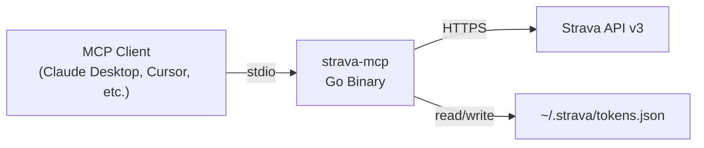
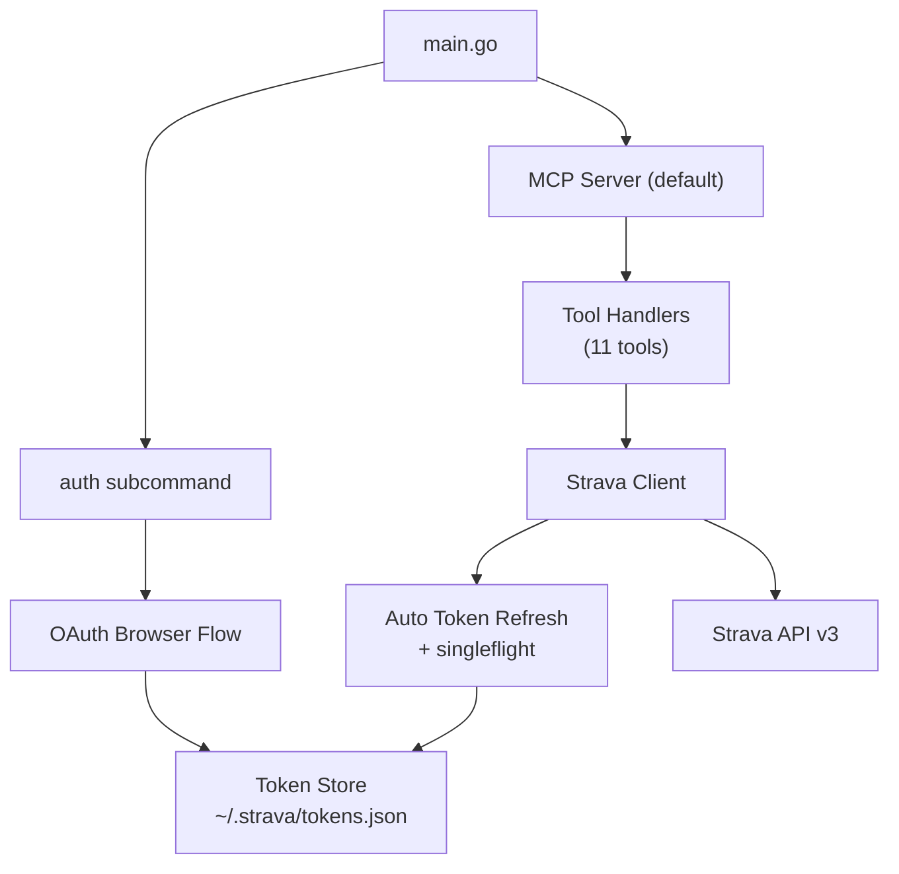

[](https://go.dev/)
[](https://goreportcard.com/report/github.com/Stealinglight/StravaMCP)
[](https://pkg.go.dev/github.com/Stealinglight/StravaMCP)
[](LICENSE)
[](https://github.com/Stealinglight/StravaMCP/actions)
[](https://github.com/Stealinglight/StravaMCP/releases/latest)
[](https://github.com/Stealinglight/StravaMCP/releases)
[](README.md#tool-reference)

# StravaMCP

**A fast, self-contained Go binary that gives any MCP client full access to the Strava API -- zero cloud infrastructure required.**

StravaMCP is a [Model Context Protocol](https://modelcontextprotocol.io) server that connects AI assistants to the Strava API through a single binary running on your machine. It communicates over stdio, works with Claude Desktop, Cursor, and any MCP-compatible client, handles OAuth authentication through an automatic browser flow, and stores tokens locally in a JSON file. No AWS, no Docker, no database -- just download and run.

<!-- Terminal recording: see demo.tape for VHS source -->

*Authentication and tool usage with Claude Desktop*

## How It Works



## Features

- **Single binary, no runtime dependencies** -- no Docker, no cloud, no database
- **11 MCP tools** covering activities, athlete stats, streams, clubs, and uploads
- **Automatic OAuth browser flow** -- one command to authenticate
- **Transparent token refresh** with concurrent request coalescing via singleflight
- **Cross-platform** -- macOS (Intel + Apple Silicon) and Linux (amd64 + arm64)
- **Install via go install, Homebrew, or direct binary download**

## Quick Start

### Install

Choose your preferred installation method:

**Option A: Go install**

```bash
go install github.com/Stealinglight/StravaMCP@latest
```

**Option B: Homebrew**

```bash
brew install Stealinglight/tap/strava-mcp
```

**Option C: Download binary**

Download the latest binary for your platform from [GitHub Releases](https://github.com/Stealinglight/StravaMCP/releases/latest).

> **macOS Gatekeeper note:** If you download the binary directly, macOS may quarantine it. Remove the quarantine attribute before running:
> ```bash
> xattr -d com.apple.quarantine strava-mcp
> ```

### Set Up Strava API Credentials

1. Create a Strava API application at [https://www.strava.com/settings/api](https://www.strava.com/settings/api)
2. Set the **Authorization Callback Domain** to `localhost`
3. Export your credentials:

```bash
export STRAVA_CLIENT_ID=your_client_id
export STRAVA_CLIENT_SECRET=your_client_secret
```

### Authenticate

Run the built-in OAuth flow. This opens your browser, completes authorization, and saves tokens locally:

```bash
strava-mcp auth
```

You should see: `Authenticated as [Your Name]!`

### Configure Your MCP Client

Add StravaMCP to your client's configuration. For **Claude Desktop**, edit `~/Library/Application Support/Claude/claude_desktop_config.json`:

```json
{
  "mcpServers": {
    "strava": {
      "command": "strava-mcp",
      "env": {
        "STRAVA_CLIENT_ID": "your_client_id",
        "STRAVA_CLIENT_SECRET": "your_client_secret"
      }
    }
  }
}
```

Restart your MCP client and the Strava tools will be available.

<details>
<summary><strong>Tool Reference (11 tools)</strong></summary>

| Tool | Category | Description |
|------|----------|-------------|
| `get_activities` | Activities | List recent activities with date filtering and pagination |
| `get_activity_by_id` | Activities | Get detailed activity info including laps, splits, and segment efforts |
| `create_activity` | Activities | Create a new manual activity |
| `update_activity` | Activities | Update an existing activity (name, description, sport type, gear) |
| `get_activity_zones` | Activities | Get heart rate and power zone distribution |
| `get_athlete` | Athlete | Get authenticated athlete profile |
| `get_athlete_stats` | Athlete | Get aggregate statistics (recent/YTD/all-time totals) |
| `get_activity_streams` | Streams | Get time-series telemetry data (HR, GPS, power, cadence, altitude) |
| `get_club_activities` | Clubs | List recent activities from club members |
| `create_upload` | Uploads | Upload activity files (GPX, TCX, FIT) |
| `get_upload` | Uploads | Check upload processing status |

</details>

<details>
<summary><strong>Architecture</strong></summary>



**Key design decisions:**

- **stderr-only logging** -- all logging via `slog` to stderr; stdout is reserved exclusively for MCP JSON-RPC protocol messages
- **singleflight.Group** -- concurrent token refresh requests are coalesced into a single Strava API call, preventing thundering herd
- **Atomic write-then-rename token store** -- token file updates are crash-safe; partial writes never corrupt saved credentials
- **Static binary with zero CGO** -- compiles to a single static binary with no C dependencies, enabling simple cross-platform distribution

</details>

## Configuration

| Variable | Required | Default | Description |
|----------|----------|---------|-------------|
| `STRAVA_CLIENT_ID` | Yes | *(none)* | Strava API application client ID |
| `STRAVA_CLIENT_SECRET` | Yes | *(none)* | Strava API application client secret |
| `STRAVA_TOKEN_PATH` | No | `~/.strava/tokens.json` | Path to token storage file |

### CLI Flags

| Flag | Description |
|------|-------------|
| `strava-mcp auth` | Run OAuth browser flow to authenticate |
| `strava-mcp --version` | Print version, commit, and build date |
| `strava-mcp --debug` | Enable debug-level logging |
| `strava-mcp` | Start MCP server on stdio (default) |

## Development

```bash
# Build
go build .

# Run tests
go test ./...

# Run with debug logging
STRAVA_CLIENT_ID=xxx STRAVA_CLIENT_SECRET=xxx ./strava-mcp --debug
```

See [CONTRIBUTING.md](CONTRIBUTING.md) for development guidelines.

## License

[ISC](LICENSE)

## Links

- [Strava API Documentation](https://developers.strava.com)
- [Model Context Protocol Specification](https://modelcontextprotocol.io)
- [GitHub Releases](https://github.com/Stealinglight/StravaMCP/releases)
