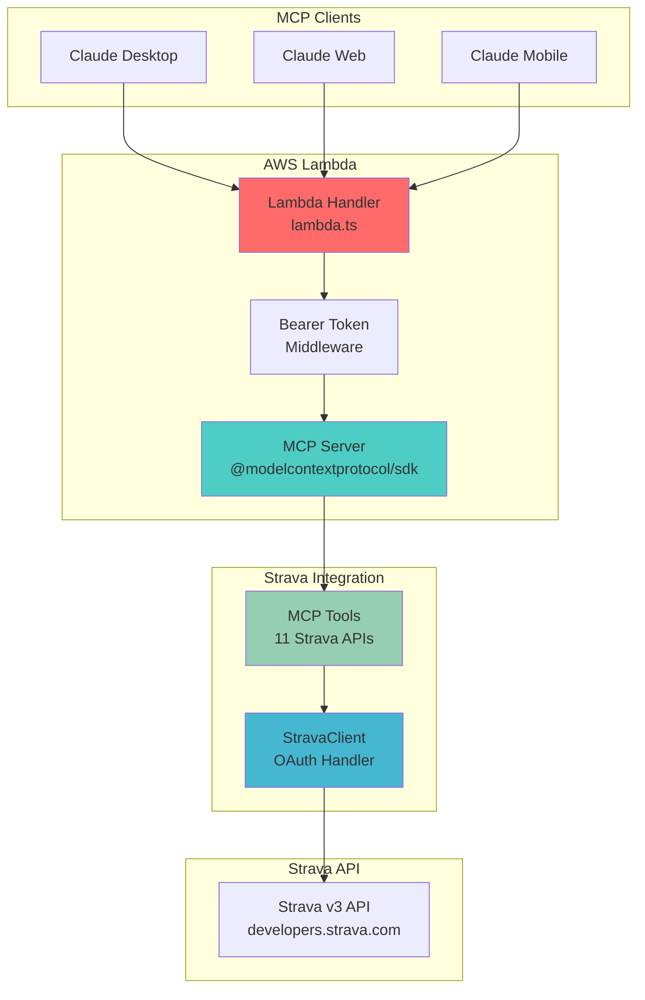
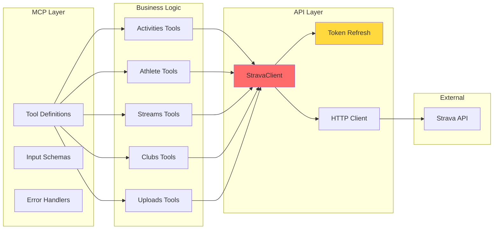

# Development Guide
{: .no_toc }

Guide for developers who want to contribute to or fork the Strava MCP Server.
{: .fs-6 .fw-300 }

## Table of contents
{: .no_toc .text-delta }

1. TOC
{:toc}

---

## Quick Start

### Prerequisites

- **[Bun](https://bun.sh)** - Fast JavaScript runtime and package manager
- **[AWS CLI](https://aws.amazon.com/cli/)** - Configured with your credentials
- **[AWS SAM CLI](https://docs.aws.amazon.com/serverless-application-model/latest/developerguide/install-sam-cli.html)** - Serverless deployment tool
- **[Git](https://git-scm.com/)** - Version control
- **[Strava API Credentials](https://www.strava.com/settings/api)** - Client ID and Secret

### Local Setup

```bash
# Clone the repository
git clone https://github.com/Stealinglight/StravaMCP.git
cd StravaMCP

# Install dependencies
bun install

# Copy environment template
cp .env.example .env

# Edit .env with your Strava credentials
# STRAVA_CLIENT_ID=your_client_id
# STRAVA_CLIENT_SECRET=your_client_secret
# STRAVA_REFRESH_TOKEN=your_refresh_token
```

### Get Strava Refresh Token

```bash
node get-token.js YOUR_CLIENT_ID YOUR_CLIENT_SECRET
```

This opens your browser for Strava authorization and displays your refresh token.

### Local Development Server

```bash
# Start development server (with auto-reload)
bun run dev

# Server runs at http://localhost:3000
# MCP endpoint: http://localhost:3000/mcp
```

{: .note }
> The local server uses JSON-RPC over HTTP for MCP connections.

---

## Architecture

### System Overview



### Component Architecture



---

## Project Structure

```
StravaMCP/
├── src/
│   ├── lambda.ts              # Lambda entry point (Streamable HTTP)
│   ├── index.ts               # Local dev server (JSON-RPC over HTTP)
│   ├── lib/
│   │   └── strava-client.ts   # OAuth client with auto-refresh
│   ├── tools/                 # MCP tool implementations
│   │   ├── activities.ts      # Activity CRUD operations
│   │   ├── athlete.ts         # Athlete profile & stats
│   │   ├── streams.ts         # Telemetry data access
│   │   ├── clubs.ts           # Club activities
│   │   └── uploads.ts         # File upload handling
│   ├── config/
│   │   ├── env.ts             # Environment variables
│   │   └── types.ts           # TypeScript type definitions
│   └── utils/
│       ├── errors.ts          # Error handling utilities
│       └── formatters.ts      # Response formatting
├── scripts/
│   ├── deploy.ts              # Automated deployment script
│   └── show-config.ts         # Display MCP configuration
├── docs/                      # GitHub Pages documentation
│   ├── index.md               # Home page
│   ├── deployment.md          # Deployment guide
│   ├── authentication.md      # Auth guide
│   ├── api.md                 # API reference
│   ├── examples.md            # Usage examples
│   ├── freetier.md            # AWS Free Tier guide
│   ├── development.md         # This file
│   └── changelog.md           # Version history
├── template.yaml              # AWS SAM CloudFormation template
├── tsconfig.json              # TypeScript configuration
├── package.json               # Dependencies and scripts
├── get-token.js               # OAuth token retrieval helper
└── README.md                  # Project overview
```

---

## Key Components

### 1. Lambda Handler (`src/lambda.ts`)

The Lambda entry point implements:
- **Streamable HTTP Transport** for remote MCP
- **Bearer Token Authentication** middleware
- **MCP Server Integration** via @modelcontextprotocol/sdk
- **JSON-RPC over HTTP** for tool communication

**Key Functions:**
- `handler()` - Main Lambda handler
- Authentication middleware validates `Authorization: Bearer <token>`
- Routes requests to MCP server
- Streams responses back to client

### 2. Strava Client (`src/lib/strava-client.ts`)

OAuth 2.0 client with automatic token management:

**Features:**
- **Automatic Token Refresh** - Refreshes 5 minutes before expiry
- **Thread-Safe** - Prevents concurrent refresh attempts
- **Generic Request Method** - Supports all Strava API endpoints
- **Type-Safe** - Full TypeScript support

**Methods:**
- `request<T>(method, endpoint, data?, config?)` - Generic API request
- `get<T>(endpoint, config?)` - GET request
- `post<T>(endpoint, data?, config?)` - POST request
- `put<T>(endpoint, data?, config?)` - PUT request
- `delete<T>(endpoint, config?)` - DELETE request

{: .warning }
> **Critical**: Never implement your own token refresh logic. StravaClient handles this automatically and safely.

### 3. MCP Tools (`src/tools/*.ts`)

All tools follow this structure:

```typescript
import { z } from 'zod';
import { StravaClient } from '../lib/strava-client.js';
import { withErrorHandling } from '../utils/errors.js';

// 1. Define Zod schema for validation
export const MyToolSchema = z.object({
  param1: z.string().describe('Parameter description'),
  param2: z.number().optional().describe('Optional parameter'),
});

// 2. Implement tool function
export const myTool = withErrorHandling(
  async (client: StravaClient, params: z.infer<typeof MyToolSchema>) => {
    return await client.get<ResponseType>('/endpoint', { params });
  }
);

// 3. Define MCP tool metadata
export const myToolsDefinition = [
  {
    name: 'my_tool',
    description: 'Detailed description for AI agents...',
    inputSchema: {
      type: 'object',
      properties: {
        param1: { type: 'string', description: 'Parameter description' },
        param2: { type: 'number', description: 'Optional parameter' },
      },
      required: ['param1'],
    },
  },
];
```

### 4. Deployment System

**scripts/deploy.ts:**
- Auto-generates AUTH_TOKEN if not present
- Runs `sam build && sam deploy --guided`
- Displays formatted MCP configuration
- Saves configuration to `samconfig.toml`

**scripts/show-config.ts:**
- Reads AUTH_TOKEN from `samconfig.toml`
- Fetches Function URL from CloudFormation
- Displays complete MCP client configuration

---

## Adding a New Tool

Follow these steps to add a new Strava API tool:

### Step 1: Create Tool File

Create `src/tools/my-new-tool.ts`:

```typescript
import { z } from 'zod';
import { StravaClient } from '../lib/strava-client.js';
import { withErrorHandling } from '../utils/errors.js';

// Define input schema
export const GetMyDataSchema = z.object({
  id: z.number().describe('Resource ID'),
  detailed: z.boolean().optional().describe('Include detailed info'),
});

// Implement function
export const getMyData = withErrorHandling(
  async (client: StravaClient, params: z.infer<typeof GetMyDataSchema>) => {
    const { id, detailed } = params;
    return await client.get(`/my-endpoint/${id}`, {
      params: { detailed },
    });
  }
);

// Export tool definition
export const myNewTools = [
  {
    name: 'get_my_data',
    description: `Retrieves data from Strava endpoint.
    
    Use this tool when you need to access specific resource data.
    
    Parameters:
    - id: The resource identifier
    - detailed: Set to true for complete information
    
    Returns detailed resource information including metadata.`,
    inputSchema: {
      type: 'object' as const,
      properties: {
        id: {
          type: 'number' as const,
          description: 'Resource ID',
        },
        detailed: {
          type: 'boolean' as const,
          description: 'Include detailed information',
        },
      },
      required: ['id'],
    },
  },
];
```

### Step 2: Register Tool

Add to `src/lambda.ts` (Lambda) and `src/index.ts` (local dev):

```typescript
import { myNewTools } from './tools/my-new-tool.js';

// In setupServer() function
server.setRequestHandler(ListToolsRequestSchema, async () => ({
  tools: [
    ...activitiesTools,
    ...athleteTools,
    // ... other tools
    ...myNewTools, // Add your new tool
  ],
}));
```

### Step 3: Add Types

Update `src/config/types.ts` if needed:

```typescript
export interface MyDataResponse {
  id: number;
  name: string;
  data: any;
}
```

### Step 4: Document Tool

Add to `docs/api.md`:

```markdown
### get_my_data

Retrieves data from Strava endpoint.

**Parameters**:
- `id` (number, required): Resource ID
- `detailed` (boolean, optional): Include detailed information

**Example**:
```json
{
  "id": 123456,
  "detailed": true
}
```

**Response**: Resource data with metadata
```

### Step 5: Test

```bash
# Local test
bun run dev

# Deploy
bun run build:lambda
bun run deploy:fast
```

---

## Development Workflow

### Local Development

1. **Start dev server:**
   ```bash
   bun run dev
   ```

2. **Configure Claude Desktop** to connect to local server:
   ```json
   {
     "mcpServers": {
       "strava-local": {
         "url": "http://localhost:3000/mcp"
       }
     }
   }
   ```

3. **Make changes and test** (server auto-reloads)

### Testing Lambda Locally

```bash
# Test Lambda handler locally
bun run dev:lambda

# Or use SAM
sam build
sam local invoke
```

### Build and Deploy

```bash
# Full build
bun run build:lambda

# Deploy with prompts
bun run deploy

# Quick deploy (uses saved config)
bun run deploy:fast

# View configuration
bun run deploy:show-config
```

---

## Important Patterns

### OAuth Token Management

{: .warning }
> **Never implement custom token refresh logic**

The StravaClient handles token refresh automatically:
- Refreshes 5 minutes before expiry
- Thread-safe (prevents concurrent refreshes)
- Retries failed requests with fresh token

### Error Handling

All tools use `withErrorHandling` wrapper:

```typescript
export const myTool = withErrorHandling(
  async (client, params) => {
    // Implementation
  }
);
```

This provides:
- Consistent error format
- Proper error logging
- Graceful failure handling

### Logging Convention

{: .warning }
> **Critical: Use `console.error()` for ALL logging**

```typescript
// ✅ Correct
console.error('[StravaClient] Token refreshed');
console.error('[MyTool] Processing request:', params);

// ❌ Wrong - breaks MCP protocol
console.log('This will break MCP communication');
```

**Why?** MCP protocol uses stdout for communication. Logging to stdout will corrupt the protocol messages.

---

## Testing

### Unit Tests

*Coming soon - test framework setup in progress*

### Integration Testing

Test deployed Lambda function:

```bash
# Get your AUTH_TOKEN and URL
bun run deploy:show-config

# Test health endpoint
curl -H "Authorization: Bearer <token>" <function-url>/health

# Test with Claude
# Configure Claude Desktop and try: "Get my recent activities"
```

### Manual Testing Checklist

- [ ] Local dev server starts without errors
- [ ] Lambda deployment succeeds
- [ ] Health check returns 200 OK
- [ ] Claude Desktop can connect
- [ ] All 11 tools are listed
- [ ] Sample tool execution works
- [ ] OAuth token refresh works
- [ ] Error handling returns proper messages

---

## Common Issues

### "sam: command not found"

Install AWS SAM CLI:
```bash
brew install aws-sam-cli
```

### "Unable to locate credentials"

Configure AWS CLI:
```bash
aws configure
```

### OAuth Token Expired

Re-run token script:
```bash
node get-token.js YOUR_CLIENT_ID YOUR_CLIENT_SECRET
```

Update deployment:
```bash
sam deploy --parameter-overrides StravaRefreshToken=NEW_TOKEN
```

### TypeScript Errors

Ensure dependencies are installed:
```bash
bun install
bun run typecheck
```

---

## Code Style

### TypeScript

- **Strict mode enabled** - No implicit any
- **Use explicit types** for function parameters and returns
- **Prefer interfaces** for object shapes
- **Use const** for immutable values

### Naming Conventions

- **Files**: kebab-case (`strava-client.ts`)
- **Functions**: camelCase (`getActivities`)
- **Types**: PascalCase (`ActivitySummary`)
- **Constants**: UPPER_SNAKE_CASE (`STREAM_TYPES`)

### Documentation

- JSDoc comments for all public functions
- Parameter descriptions for all Zod schemas
- Detailed tool descriptions for AI agents

---

## Deployment Best Practices

### Environment Variables

Always use environment variables for:
- API credentials (Strava tokens)
- Auth tokens (AUTH_TOKEN)
- Configuration values

Define in `template.yaml` and load in `src/config/env.ts`.

### Security

- **Never commit** `.env` or `samconfig.toml`
- **Use gitignore** for sensitive files
- **Rotate tokens** periodically
- **Review CloudWatch logs** for suspicious activity

### Performance

- **Minimize cold starts** - Keep Lambda warm if needed
- **Optimize bundle size** - Only include necessary dependencies
- **Use ARM64** architecture - 20% better performance

---

## Contributing

See [CONTRIBUTING.md](../CONTRIBUTING.md) for contribution guidelines.

---

## Resources

- **[Strava API Documentation](https://developers.strava.com)** - Official API reference
- **[MCP Specification](https://modelcontextprotocol.io)** - Protocol documentation
- **[AWS Lambda Docs](https://docs.aws.amazon.com/lambda/)** - Lambda documentation
- **[Bun Documentation](https://bun.sh/docs)** - Bun runtime reference

---

Need help? [Open an issue](https://github.com/Stealinglight/StravaMCP/issues) on GitHub!
